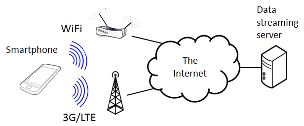

# GreenBag

## Introduction

Modern mobile devices are equipped with multiple network interfaces, including 3G/LTE and WiFi. Bandwidth aggregation over LTE and WiFi links offers an attractive opportunity for supporting bandwidth-intensive services, such as high-quality video streaming, on mobile devices.

GreenBag project introduces an energy-efficient bandwidth aggregation middleware that supports real-time data-streaming services over asymmetric wireless links, requiring no modification to the existing Internet infrastructure.

This prototpye was developed as part of [a research project](http://cps.kaist.ac.kr/greenbag). The [paper](http://cps.kaist.ac.kr/papers/13RTSS_GreenBag_PID2926259.pdf) was published on the 34th IEEE Real-Time Systems Symposium (RTSS '13).

## Demo

### Dual Link vs Single Link on mobile phones

## No more video interruption time

## Energy-efficient video streaming

## How to build
This source code can be built for Android or Linux desktop platforms. The following build commands for desktops were tested on gcc 5.4.0 on Ubuntu 16.04. You can build on Android by using gcc in Android NDK.

* Standalone mode: In this mode, GreenBag works like a typical downloader, such as wget.  
`make standalone`

* Proxy mode: This is the original mode. Greenbag was designed to use as a proxy to between the server and the video player. However, this mode requires some additional setup.  
`make`

## Server configuration
I tested with an Apache2 server which allows an unlimited maximum number of requests during a persistent connection. You need to add `MaxKeepAliveRequests 0` on the server's configuration file (e.g., `/etc/apache2/apache2.conf`)

## Setting routing tables for multiple network interfaces on Linux
Although Android will automatically set up routing tables correctly when there are multiple network interfaces in the system, desktop Linux distributions typically do not. You can set up the routing tables on Linux using [setup_routing_tables.sh](scripts/setup_routing_tables.sh).

## Running GreenBag
Run GreenBag with fixed segment sizes (`-F 1`), each segment is 2048 KB large (`-S 2048`)  
`./gb http://143.248.140.50:8088/files/Gangnam.mp4 -F 1 -S 2048` 

More options are in [gbsession.c](https://github.com/ducalpha/greenbag/blob/master/src/gbsession.c).

The download time should be faster than when using wget to download over a single link:  
`wget --bind-address=$ip0 http://server.com/files/1GB`  
`wget --bind-address=$ip1 http://server.com/files/1GB`

You can also set bandwidth using [tcconfig](https://github.com/thombashi/tcconfig). An example script is include in [limit_bandwidth_for_testing.sh](scripts/limit_bandwidth_for_testing.sh).

## Limitations of this implementation
* Use disk to store in-progress file parts.
* Does not determine bitrate of videos automatically.
* Require MaxKeepAliveRequests on the server side.
* Does not set routing tables automatically.
* Does not fully support flexible segment sizes, which should be adaptive to network conditions such as bandwidth and RTT.

## How to enable multiple network interfaces on Android
In order to enable LTE and WiFi simultaneously on Samsung Galaxy S2 phone where the source code of the Android framework was not available, we reversed engineered and modified ConnectivityService in the Android framework. You can find details in [How to Enable Multiple Network Interfaces on Android](https://docs.google.com/document/d/1zpRF1jbZ6egCjiRn0DGuIvaAHzBEEisHnEoX3U4oupE/edit?usp=sharing).

